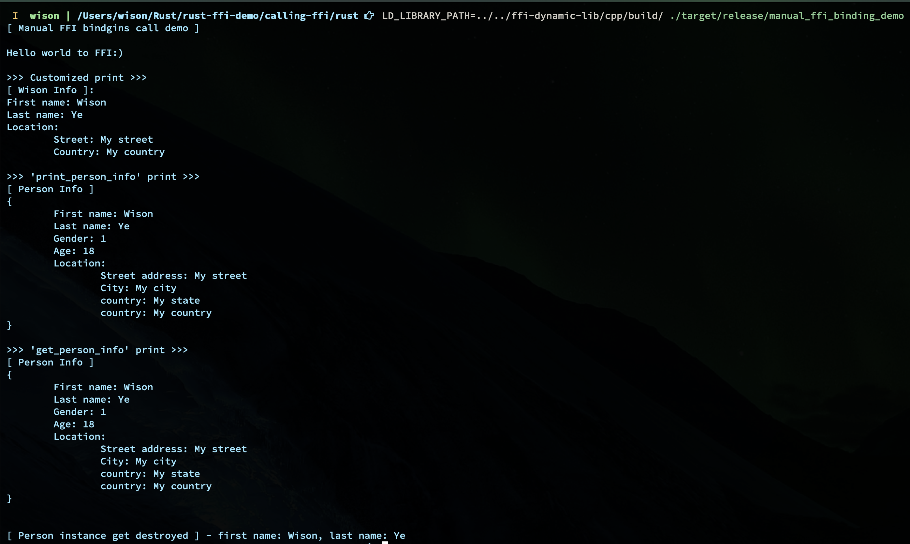

# Rust `FFI` (Foreign Function Interface) Demo

[1. What is `ABI` and `FFI`?](#1-what-is-abi-and-ffi)</br>

[2. Let's build a `C++` library for this tutorial](#2-lets-build-a-c-library-for-this-tutorial)</br>
[2.1 What will export via the `C++ Dynamic Library`](#21-what-will-export-via-the-c-dynamic-library)</br>
[2.2 Install `C++` and `cmake` building tools](#22-install-c-and-cmake-building-tools)</br>
[2.3 Use `cmake` to compile a dynamic library](#23-use-cmake-to-compile-a-dynamic-library)</br>
[2.4 How to inspect the library's dynamic symbol table](#24-how-to-inspect-the-librarys-dynamic-symbol-table)</br>

[3. How Rust deal with `FFI`?](#3-how-rust-deal-with-ffi)</br>
[3.1 `#[link]`](#31-link)</br>
[3.2 `extern` block](#32-extern)</br>
[3.3 How to transfers data type between `Rust` and `C/C++`?](#33-how-rust-transfers-data-type-between-rust-and-cc)</br>
[3.4 How to generate the `extern` block from a `C/C++` header file?](#34-how-to-generate-the-extern-block-from-a-cc-header-file)</br>
[3.5 How `cargo build` knows where to link the `C++ dynamic library`?](#35-how-cargo-build-knows-where-to-link-the-c-dynamic-library)</br>

[4. Let's call `C++` function in `Rust`](#4-lets-call-c-function-in-rust)</br>
[4.1 Use manual `FFI` bindings](#41-use-manual-ffi-bindings)</br>
[4.2 Use `bindgen` automatic `FFI` bindings](#42-use-bindgen-automatic-ffi-bindings)</br>


## 1. What is `ABI` and `FFI`

- `ABI` which stands for `Application Binary Interface`.

    It's an interface between two binary program modules. It looks like the `API` but focus on the `Compiler & Linker`, 
    as it covers:

    - processor instruction set (with details like register file structure, stack organization, memory access types, ...)
    - the sizes, layouts, and alignments of basic data types that the processor can directly access
    - the calling convention, which controls how the arguments of functions are passed, and return values retrieved. For example, it controls:
        - whether all parameters are passed on the stack, or some are passed in registers;
        - which registers are used for which function parameters;
        - and whether the first function parameter passed on the stack is pushed first or last onto the stack.
    - how an application should make system calls to the operating system, and if the ABI specifies direct system calls rather than procedure calls to system call stubs, the system call numbers.
    - and in the case of a complete operating system ABI, the binary format of object files, program libraries, and so on.

</br>

- `FFI` which stands for `Foreign Function Interface`

    It's talking about how the rust code can call the function outside the rust world.

</br>

## 2. Let's build a `C++` library for this tutorial

#### 2.1 What will export via the `C++ Dynamic Library`:

```c++
#pragma once
//#include <string>

namespace Demo {

// Simple function case
void print_helloworld();

//
// A more complex case with `enum`, `struct`, and a couple of
// functions to manipulate those data.
//
enum Gender {
    Female, Male
};

struct Location {
    // string street_address;
    // string city;
    // string state;
    // string country;
    const char* street_address;
    const char* city;
    const char* state;
    const char* country;
};

struct Person {
    // string first_name;
    // string last_name;
    const char* first_name;
    const char* last_name;
    Gender sex;
    unsigned char age;
    Location location;

    ~Person();
};

// Create `Person` instance on the heap and return pointer
Person* create_new_person(
        // string first_name, 
        // string last_name, 
        const char* first_name, 
        const char* last_name, 
        Gender sex,
        unsigned char age,
        Location location);

// Pass the `Person` pointer as parameter
void print_person_info(Person* ptr);

// Pass the `Person` pointer as parameter and get back C-style string
const char* get_person_info(Person* p);

// Pass the `Person` pointer as parameter
void release_person_pointer(Person* ptr);

} // namespace Demo
```

As you can see above, the `C++ Dynamic Library` will export some `enum` and `struct` types and some functions to maniplulate those stuff.

Because the `std::string` actually is a `class` (like a `vector<char>` or `vector<w_char>`) to manage the strings, it uses to enhance the `C-style string` (a char array), so we don't use this type at this moment to reduce the complexicy.

</br>

#### 2.2 Install `C++` and `cmake` building tools

- Arch
    
    ```bash
    sudo pacman --sync --refresh clang libc++ cmake
    ```

- MacOS

    ```bash
    brew install llvm clang cmake
    ```

</br>

#### 2.3 Use `cmake` to compile a dynamic library

```bash
cd cpp && rm -rf build && mkdir build && cd build
cmake ../ && make
```

After that, `cmake` compiles your cpp project and generate the files below in the `cpp/build` folder:

```bash
ffi-demo-cpp-lib_debug_version
ffi-demo-cpp-lib

# This is the C++ dynamic library which uses in this FFI demo
# The library filename extension will be:
# - `.dylib` on `MacOS`
libdemo.dylib
# - `.so` on `Linux`
libdemo.so
# - `.dll` on `Windows`
libdemo.dll
```

</br>

#### 2.4 How to inspect the library's dynamic symbol table

- Linux

    ```bash
    objdump -T libdemo.so | grep "hello\|person\|Person\|Location"
    # 0000000000000000      DF *UND*  0000000000000000              __gxx_personality_v0
    # 0000000000003310 g    DF .text  00000000000000b4  Base        _ZN4Demo16print_helloworldEv
    # 00000000000036f0 g    DF .text  0000000000000224  Base        _ZN4Demo17print_person_infoEPNS_6PersonE
    # 00000000000033d0 g    DF .text  0000000000000107  Base        _ZN4Demo6PersonD1Ev
    # 00000000000033d0 g    DF .text  0000000000000107  Base        _ZN4Demo6PersonD2Ev
    # 0000000000003920 g    DF .text  00000000000003ed  Base        _ZN4Demo15get_person_infoEPNS_6PersonE
    # 00000000000034e0 g    DF .text  00000000000001ba  Base        _ZN4DemolsERNSt3__113basic_ostreamIcNS0_11char_traitsIcEEEERKNS_6PersonE
    # 0000000000003d10 g    DF .text  0000000000000018  Base        _ZN4Demo22release_person_pointerEPNS_6PersonE
    # 00000000000036a0 g    DF .text  0000000000000049  Base        _ZN4Demo17create_new_personEPKcS1_NS_6GenderEhNS_8LocationE


    # Or
    nm -f bsd libdemo.so | grep "hello\|person\|Person\|Location"
    # 0000000000007128 d DW.ref.__gxx_personality_v0
    #                  U __gxx_personality_v0
    # 0000000000003920 T _ZN4Demo15get_person_infoEPNS_6PersonE
    # 0000000000003310 T _ZN4Demo16print_helloworldEv
    # 00000000000036a0 T _ZN4Demo17create_new_personEPKcS1_NS_6GenderEhNS_8LocationE
    # 00000000000036f0 T _ZN4Demo17print_person_infoEPNS_6PersonE
    # 0000000000003d10 T _ZN4Demo22release_person_pointerEPNS_6PersonE
    # 00000000000033d0 T _ZN4Demo6PersonD1Ev
    # 00000000000033d0 T _ZN4Demo6PersonD2Ev
    # 00000000000034e0 T _ZN4DemolsERNSt3__113basic_ostreamIcNS0_11char_traitsIcEEEERKNS_6PersonE
    ```

    </br>

- MacOS

    ```bash
    objdump -t libdemo.dylib | grep "hello\|person\|Person\|Location"
    # 00000000000019a0 g     F __TEXT,__text  __ZN4Demo15get_person_infoEPNS_6PersonE
    # 0000000000001310 g     F __TEXT,__text  __ZN4Demo16print_helloworldEv
    # 0000000000001690 g     F __TEXT,__text  __ZN4Demo17create_new_personEPKcS1_NS_6GenderEhNS_8LocationE
    # 00000000000016f0 g     F __TEXT,__text  __ZN4Demo17print_person_infoEPNS_6PersonE
    # 0000000000001d80 g     F __TEXT,__text  __ZN4Demo22release_person_pointerEPNS_6PersonE
    # 00000000000014b0 g     F __TEXT,__text  __ZN4Demo6PersonD1Ev
    # 00000000000013b0 g     F __TEXT,__text  __ZN4Demo6PersonD2Ev
    # 00000000000014c0 g     F __TEXT,__text  __ZN4DemolsERNSt3__113basic_ostreamIcNS0_11char_traitsIcEEEERKNS_6PersonE


    # Or
    nm -f bsd libdemo.dylib | grep "hello\|person\|Person\|Location"
    # 00000000000019a0 T __ZN4Demo15get_person_infoEPNS_6PersonE
    # 0000000000001310 T __ZN4Demo16print_helloworldEv
    # 0000000000001690 T __ZN4Demo17create_new_personEPKcS1_NS_6GenderEhNS_8LocationE
    # 00000000000016f0 T __ZN4Demo17print_person_infoEPNS_6PersonE
    # 0000000000001d80 T __ZN4Demo22release_person_pointerEPNS_6PersonE
    # 00000000000014b0 T __ZN4Demo6PersonD1Ev
    # 00000000000013b0 T __ZN4Demo6PersonD2Ev
    # 00000000000014c0 T __ZN4DemolsERNSt3__113basic_ostreamIcNS0_11char_traitsIcEEEERKNS_6PersonE


    # Also, you can print the shared libraries used for linked Mach-O files:
    objdump -macho -dylibs-used libdemo.dylib
    # libdemo.dylib:
    #         @rpath/libdemo.dylib (compatibility version 0.0.0, current version 0.0.0)
    #         /usr/lib/libc++.1.dylib (compatibility version 1.0.0, current version 400.9.4)
    #         /usr/lib/libSystem.B.dylib (compatibility version 1.0.0, current version 1252.250.1)
    ```

</br>

## 3. How Rust deal with `FFI`

#### 3.1 `#[link]`

The link attribute specifies the name of a native library 
that the compiler should link with for the items within an
extern block. 

```rust
#[link(name = "demo")]
extern {
    // …
}
```

In the above sample, `rustc` would try to link with `libdemo.so`
on unix-like systems and `demo.dll `on Windows at runtime. It 
panics if it can't find something to link to.  That's why you need
to make sure `rustc` can find the library file when linking. 

Also, you can add the `kind` value to say which kind the library it is:

- `dylib` — Indicates a dynamic library. This is the default if kind is not specified.
- `static` — Indicates a static library.
- `framework` — Indicates a `macOS` framework. This is only valid for `macOS` targets.

</br>

Here is the sample:

```rust
#[link(name = "CoreFoundation", kind = "framework")]
extern {
    // …
}
```

</br>

Another value you can put there is the `wasm_import_module` which use for linking
to the `WebAssembly` module case:

```rust
#[link(wasm_import_module = "wasm_demo")]
extern {
    // …
}
```

</br>


**Actually, the best practice is NOT use `#[link]` on the `extern` block. Instead, use the cargo instructions below in **`build.rs`** which will mentioned in the later chapters.**

- `cargo:rustc-link-lib=dylib=demo`
- `cargo:rustc-link-search=native=cpp/build`

</br>

#### 3.2 `extern`
    
The [`extern`](https://doc.rust-lang.org/stable/std/keyword.extern.html) block includes all the external function signatures.

```rust
#[link(name = "demo_c_lib")]
extern "C" {
    #[link_name = "\u{1}_ZN4Demo16my_c_functionEv"]
    fn my_c_function(x: i32) -> bool;
}
```

The `C` part actually is the `ABI` string, you can just write `extern` without `C` as the `C` is the default ABI.

Below is the `ABI` support list from [official `ABI` section](https://doc.rust-lang.org/stable/reference/items/external-blocks.html):


</br>

The `#[link_name]` helps link to the correct external function which can be generated by the `bindgen` command.

</br>

#### 3.3 How `Rust` transfers data type between `Rust` and `C/C++`?

There are two modules to handle that:

- [`std::os:raw`](https://doc.rust-lang.org/stable/std/os/raw/index.html): Platform-specific types, as defined by C.
    
    | Rust type     | C/C++ type |
    |-------------- |----------------------------
    | `c_char`      | Equivalent to C's `char` type.
    | `c_double`    | Equivalent to C's `double` type.
    | `c_float`     | Equivalent to C's `float` type.
    | `c_int`       | Equivalent to C's `signed int (int)` type.
    | `c_long`      | Equivalent to C's `signed long (long)` type.
    | `c_longlong`  | Equivalent to C's `signed long long (long long)` type.
    | `c_schar`     | Equivalent to C's `signed char` type.
    | `c_short`     | Equivalent to C's `signed short (short)` type.
    | `c_uchar`     | Equivalent to C's `unsigned char` type.
    | `c_uint`      | Equivalent to C's `unsigned int` type.
    | `c_ulong`     | Equivalent to C's `unsigned long` type.
    | `c_ulonglong` | Equivalent to C's `unsigned long long` type.
    | `c_ushort`    | Equivalent to C's `unsigned short` type.

    </br>

- [`std::ffi`](https://doc.rust-lang.org/stable/std/ffi/index.html): 

    In particular, the `C-Style String` is the standard `C` string when dealing with `C/C++ FFI`.
    `C-Style String` just an `array of char (char[])`, but the string is nul-terminated which means
    they have a `\0` character at the end of the string. 

    The usual form is been using as a pointer:

    ```c++
    // const char[] pointer
    const char* ptr;

    // char[] pointer
    char* ptr;
    ```

    Below is usual case in `C/C++` function to
    accept a `C-Style String` or return a `C-Style String`:

    ```c++
    // `*const c_char` is rust type which equivalent to `const char*` in C/C++
    extern "C" { fn c_function_return_c_style_string() -> *const c_char; }

    // `*const c_char` is rust type which equivalent to `const char*` in C/C++
    extern "C" { fn c_function_accept_c_style_string_parameter(s: *const c_char); }
    ```

    For dealing with that `C-Style string`, `std::ffi` module introduces 2 extra data types:

    | Rust type     | Use case
    |-------------- |------------------------------------------
    | `CString`     | Pass `Rust String` as `C-Style String`
    | `CStr`        | Get back the `Rust String` by the `C-Style String`

    </br>

    So here is the use case sample:

    - Get back the `Rust String` by the `C-Style String`:

        As `c_function_return_c_style_string()` return `const char*` which means it
        just a raw pointer NOT guarantees still valid, that's why you need to wrap in
        `unsafe` block!

        The methods below dont' own the `C heap allocated` string which means you can
        use that string without copying or allocating:
        
        - `CStr::from_ptr().to_str()`
        - `CStr::from_ptr().to_string_lossy()` 
        - `CStr::from_ptr().into_c_string()` 

        </br>

        But if you're responsible for destroying that `C heap-allocated` string, then 
        you should own it and drop it after leaving the scope!

        </br>


        ```rust
        unsafe {
            let rust_string: String = CStr::from_ptr(c_function_return_c_style_string())
                .to_string_lossy()
                .into_owned();
        }
        ```

        </br>

    - Pass `Rust String` as `C-Style String`

        ```rust
        let c_string = CString::new("Hello, world!").unwrap();
        unsafe {
            c_function_accept_c_style_string_parameter(c_string.as_ptr());
        }
        ```

        </br>

#### 3.4 How to generate the `extern` block from a `C/C++` header file?

```bash
# Install `bindgen`:
cargo install bindgen

#
# bindgen [FLAGS] [OPTIONS] <header> -- <clang-args>...
#
# --disable-header-comment: Not include bindgen's version.
# --enable-cxx-namespaces: Enable support for C++ namespaces.
# --ignore-functions: Ignore functions, good for the case you only care about the `struct`.
# --no-derive-copy: No `#[derive(Copy)]` needed.
# --no-derive-debug: No `#[derive(Debug)]` needed.
# --no-doc-comments: No doc comment needed.
# --no-include-path-detection: Do not try to detect default include paths
# --no-layout-tests: No layout tests for any type.
#
# `--` Follow by all `clang_arg`:
# `-x c++`: Indictes that's the C++ if the header file not end with `.hpp`
# `-std=c++17`: The language standard version
# `-stdlib=libc++`: C++ standard library to use
#
bindgen \
    --disable-header-comment \
    --enable-cxx-namespaces \
    --no-derive-copy \
    --no-derive-debug \
    --no-doc-comments \
    --no-include-path-detection \
    --no-layout-tests \
    --output src/manual_bindings.rs \
    cpp/src/dynamic-lib/lib.h \
    -- -x c++ \
    -std=c++17 \
    -stdlib=libc++
```

For `macOS`, you might see the error below:

```bash
fatal error: 'XXXX' file not found
```

Then try to add the `-I` `clang` flag explicitly like below:

```bash
bindgen \
    --disable-header-comment \
    --enable-cxx-namespaces \
    --no-derive-copy \
    --no-derive-debug \
    --no-doc-comments \
    --no-include-path-detection \
    --no-layout-tests \
    --output src/manual_bindings.rs \
    cpp/src/dynamic-lib/lib.h \
    -- -x c++ \
    -I/Library/Developer/CommandLineTools/usr/include/c++/v1 \
    -std=c++17 \
    -stdlib=libc++
```
</br>

#### 3.5 How `cargo build` knows where to link the `C++ dynamic library`?

That's what exactly the `build script` does.

Placing a file named `build.rs` in the root of a package will cause `Cargo` to compile that script and execute it just **before** building the package. That's the right place to let `rustc` to know where to link the `C++ dynamic library`:

```rust
// FFI custom build script.
fn main() {
    //
    // The `rustc-link-lib` instruction tells `Cargo` to link the 
    // given library using the compiler's `-l` flag. This is typically
    // used to link a native library using FFI.
    //
    // If you've already add a `#[link(name = "demo"]` in the `extern`
    // block, then you don't need to provide this.
    //
    println!("cargo:rustc-link-lib=dylib=demo");

    //
    // The `rustc-link-search` instruction tells Cargo to pass the `-L` 
    // flag to the compiler to add a directory to the library search path.
    //
    // The optional `KIND` may be one of the values below:
    //
    // - `dependency`: Only search for transitive dependencies in this directory.
    // - `crate`: Only search for this crate's direct dependencies in this directory.
    // - `native`: Only search for native libraries in this directory.
    // - `framework`: Only search for macOS frameworks in this directory.
    // - `all`: Search for all library kinds in this directory. This is the default 
    //          if KIND is not specified.
    //
    println!("cargo:rustc-link-search=native=cpp/build");
}
```

</br>

## 4. Let's call `C++` function in `Rust`

#### 4.1 Use manual `FFI` bindings

- Add the particular features to `Cargo.toml`:

    ```rust
    [features]
    default = []
    enable-manual-bindings = []
    ```

    `enable-manual-bindings` uses for compiling `build.rs` with the particular condition.

    </br>

- Generate [`src/manual_bindings.rs`](https://github.com/wisonye/rust-ffi-demo/blob/master/src/manual_bindings.rs) by running the command below:

    ```bash
    bindgen \
        --disable-header-comment \
        --enable-cxx-namespaces \
        --no-derive-debug \
        --no-derive-copy \
        --no-doc-comments \
        --no-include-path-detection \
        --no-layout-tests \
        --output src/manual_bindings.rs \
        cpp/src/dynamic-lib/lib.h \
        -- -x c++ \
        -std=c++17 \
        -stdlib=libc++
    ```

    After that, you can see some bindings like below:

    ```rust
    #[repr(C)]
    pub struct Person {
        pub first_name: *const ::std::os::raw::c_char,
        pub last_name: *const ::std::os::raw::c_char,
        pub sex: root::Demo::Gender,
        pub age: ::std::os::raw::c_uchar,
        pub location: root::Demo::Location,
    }

    extern "C" {
        #[link_name = "\u{1}__ZN4Demo17create_new_personEPKcS1_NS_6GenderEhNS_8LocationE"]
        pub fn create_new_person(
            first_name: *const ::std::os::raw::c_char,
            last_name: *const ::std::os::raw::c_char,
            sex: root::Demo::Gender,
            age: ::std::os::raw::c_uchar,
            location: root::Demo::Location,
        ) -> *mut root::Demo::Person;
    }
    ```

    </br>

    - `#[repr(C)]`:

        `repr` stands for `representation`, it describes a `Type Layout` which you will find
        more explanation at [here](https://doc.rust-lang.org/reference/type-layout.html).

        This is the most important `repr`. It has fairly simple intent: **do what C does**. The 
        order, size, and alignment of fields is exactly what you would expect from C or C++. Any 
        type you expect to pass through an FFI boundary should have `repr(C)`.

        If you don't do that, you will get the warning like below and your executable will crash 
        with `SIGSEGV` error.:

        ```bash
        warning: `extern` block uses type `Person`, which is not FFI-safe
        ```

    - `[link_name]`

        The `link_name` attribute indicates the symbol to import for the given function which
        you've already saw it above via the `objdump` command.

    </br>


- [`src/bin/manual_ffi_binding_demo.rs`](https://github.com/wisonye/rust-ffi-demo/blob/master/src/bin/manual_ffi_binding_demo.rs) includes all the FFI calling samples.

</br>

- Create [`build.rs`](https://github.com/wisonye/rust-ffi-demo/blob/master/build.rs) with the following content:

    ```rust
    // FFI custom build script.
    fn main() {
        //
        // Link to `libdemo` dynamic library file
        //
        println!("cargo:rustc-link-lib=dylib=demo");
    
        //
        // Let `Cargo` to pass the `-L` flag to the compiler to add
        // the searching directory for the`native` library file
        //
        println!("cargo:rustc-link-search=native=cpp/build");
    }
    ```

    This allows `Cargo` to know where to link the `C++ dynamic library` file.

</br>

- Build and run the demo
    
    ```bash
    cargo clean && cargo build \
        --bin manual_ffi_binding_demo \
        --features "enable-manual-bindings" \
        --release
    
    LD_LIBRARY_PATH=./cpp/build/ ./target/release/manual_ffi_binding_demo
    ```

    You should see demo output like below:

    

    If you print the symbol table for the release executable, you should be able to 
    notic that it relies on the FFI functions in the `C++ Dynamic Library`:

    ```bash
    nm -f bsd target/release/manual_ffi_binding_demo | grep "hello\|person\|Person\|Location"
                     U __ZN4Demo15get_person_infoEPNS_6PersonE
                     U __ZN4Demo16print_helloworldEv
                     U __ZN4Demo17create_new_personEPKcS1_NS_6GenderEhNS_8LocationE
                     U __ZN4Demo17print_person_infoEPNS_6PersonE
                     U __ZN4Demo22release_person_pointerEPNS_6PersonE
    ```

</br>

So, you've already learned how to do that in a `manual bindings` way. The advantage of this 
way is that you have an FFI binding source code when you're coding, then your editor (with
Rust language plugin) can detect any error or show you the code completion handy feature 
when you're typing. 

But the disadvantage is that you need to run `bindgen` manually every time, as the function
symbol will be changed every time after you re-generate the `C++ Dynamic Library`. That
will be trouble or inconvenience. That's how `bindgen` automatic `FFI` bindings can help.

</br>

#### 4.2 Use `bindgen` automatic `FFI` bindings


